# Git Basics Training Guide

## Prerequisites
- Install Git on your computer: https://git-scm.com/downloads
- Create a GitHub account: https://github.com
- Configure Git with your name and email:
```bash
git config --global user.name "Your Name"
git config --global user.email "your.email@example.com"
```

## 1. Create a Repository for a Project

### Option A: Create on GitHub first (Recommended)
1. Go to GitHub.com and click "New" or the "+" icon
2. Enter repository name and description
3. Choose public or private
4. Check "Add a README file"
5. Click "Create repository"
6. Clone to your local machine:
```bash
git clone https://github.com/yourusername/your-repo-name.git
cd your-repo-name
```

### Option B: Create locally first
```bash
mkdir your-project-name
cd your-project-name
git init
```

## 2. Initialize and Push from Existing Project Folder

If you have an existing project folder:

```bash
# Navigate to your project folder
cd /path/to/your/existing/project

# Initialize git repository
git init

# Add all files to staging
git add .

# Create first commit
git commit -m "Initial commit"

# Add remote repository (create empty repo on GitHub first)
git remote add origin https://github.com/yourusername/your-repo-name.git

# Push to GitHub
git push -u origin main
```

**Note:** If you get an error about 'master' vs 'main', rename your branch:
```bash
git branch -M main
```

## 3. Push Changes

After making changes to your files:

```bash
# Check what files have changed
git status

# Add specific files
git add filename.txt
# OR add all changed files
git add .

# Commit with a descriptive message
git commit -m "Add new feature: user authentication"

# Push to remote repository
git push
```

**Push to specific branch:**
```bash
git push origin branch-name
```

## 4. Pull Changes

Get the latest changes from remote repository:

```bash
# Pull from current branch
git pull

# Pull from specific branch
git pull origin main
```

**Best practice:** Always pull before starting work to get latest changes.

## 5. Check Status

```bash
# See current status of your working directory
git status

# Shows:
# - Modified files
# - New files (untracked)
# - Files ready to commit (staged)
# - Current branch
```

## 6. Understanding Git Branching (Visual Guide)

### Why Branching Matters
Branching is like creating parallel universes for your code. The main branch should always be clean and working, while feature branches let you experiment safely.

### Git Branching Architecture Flow

This diagram shows how different types of branches work together in a complete development workflow:

```mermaid
graph TD
    A[👥 Development Team] --> B{What type of work?}
    
    B -->|New Feature| C[Create feature/branch]
    B -->|Bug Fix| D[Create bugfix/branch]
    B -->|Urgent Fix| E[Create hotfix/branch]
    B -->|Experiment| F[Create experiment/branch]
    
    C --> G[🔨 Develop & Test]
    D --> G
    F --> G
    
    G --> H{Tests Pass?}
    H -->|No| I[🔄 Fix Issues]
    I --> G
    H -->|Yes| J[📝 Create Pull Request]
    
    J --> K[👀 Code Review]
    K -->|Changes Needed| I
    K -->|Approved| L[✅ Merge to Main]
    
    E --> M[🚨 Direct to Main<br/>After Testing]
    
    L --> N[🚀 Main Branch<br/>Always Deployable]
    M --> N
    
    N --> O[🌐 Deploy to Production]
    
    style N fill:#90EE90
    style O fill:#87CEEB
    style G fill:#F0E68C
    style K fill:#E1D5E7
```

### Branch Hierarchy & Flow
```mermaid
graph LR
    subgraph "🏠 Repository Structure"
        A[main<br/>🌟 Production Ready]
        
        subgraph "🔧 Development Branches"
            B[feature/user-auth<br/>👤 New login system]
            C[feature/shopping-cart<br/>🛒 E-commerce feature]
            D[bugfix/payment-error<br/>🐛 Fix checkout bug]
        end
        
        subgraph "🚨 Emergency Branches"
            E[hotfix/security-patch<br/>🔒 Critical security fix]
        end
        
        subgraph "🧪 Experimental"
            F[experiment/new-ui<br/>🎨 Testing new design]
        end
    end
    
    B --> A
    C --> A
    D --> A
    E --> A
    F -.-> G[❌ Discarded<br/>or merged later]
    
    style A fill:#90EE90
    style E fill:#FFB3B3
    style F fill:#F0E68C
```

### Basic Branching Concept
```mermaid
graph TD
    A[Initial commit] --> B[Add basic structure]
    B --> C[Fix typo in README]
    
    B --> D[🌿 feature/login branch]
    D --> E[Start login feature]
    E --> F[Add login form]
    F --> G[Add validation]
    G --> H[Complete login tests]
    
    C --> I[Merge feature/login]
    H --> I
    I --> J[Deploy v1.1]
    
    style D fill:#E8F5E8
    style I fill:#90EE90
    style J fill:#87CEEB
```

### Best Practice Workflow
```mermaid
graph TD
    A[Clean main branch] --> B[Working state ✅]
    
    B --> C[🌿 feature/user-profile]
    C --> D[Create profile page]
    D --> E[Add profile editing]
    
    B --> F[🌿 feature/notifications]
    F --> G[Add notification system]
    
    B --> H[🧪 experiment/new-ui]
    H --> I[Try new design]
    I --> J[Experiment with colors]
    
    E --> K[Merge user-profile]
    B --> K
    K --> L[Main stays clean ✅]
    
    G --> M[Merge notifications]
    L --> M
    M --> N[Still working ✅]
    
    style A fill:#90EE90
    style B fill:#90EE90
    style K fill:#90EE90
    style L fill:#90EE90
    style M fill:#90EE90
    style N fill:#90EE90
    style C fill:#E8F5E8
    style F fill:#E8F5E8
    style H fill:#FFF8DC
```

### Team Collaboration Architecture
```mermaid
sequenceDiagram
    participant Dev1 as 👨‍💻 Developer 1
    participant Dev2 as 👩‍💻 Developer 2
    participant Main as 🌟 Main Branch
    participant Prod as 🌐 Production
    
    Note over Dev1,Prod: Daily Development Workflow
    
    Dev1->>Main: 1. Pull latest changes
    Dev1->>Dev1: 2. Create feature/login-system
    Dev1->>Dev1: 3. Develop & commit changes
    
    Dev2->>Main: 1. Pull latest changes  
    Dev2->>Dev2: 2. Create feature/user-profile
    Dev2->>Dev2: 3. Develop & commit changes
    
    Dev1->>Dev1: 4. Test feature locally ✅
    Dev1->>Main: 5. Create Pull Request
    Main->>Main: 6. Code review & merge
    
    Dev2->>Dev2: 4. Test feature locally ✅
    Dev2->>Main: 5. Create Pull Request
    Main->>Main: 6. Code review & merge
    
    Main->>Prod: 7. Deploy when ready 🚀
    
    Note over Dev1,Prod: Main branch always stays clean!
```

### Development Environment Flow
```mermaid
graph TB
    subgraph "🏢 Team Development Environment"
        A[Local Development<br/>💻 Your Machine]
        B[Feature Branch<br/>🌿 feature/my-work]
        C[Remote Repository<br/>☁️ GitHub/GitLab]
        D[Main Branch<br/>🌟 Shared Codebase]
        E[Staging Environment<br/>🧪 Testing Server]
        F[Production<br/>🌐 Live Website]
    end
    
    A --> B
    B --> C
    C --> D
    D --> E
    E --> F
    
    G[👨‍💻 Developer] --> A
    H[👀 Code Review] --> D
    I[🤖 CI/CD Pipeline] --> E
    J[✅ Manual Approval] --> F
    
    style D fill:#90EE90
    style F fill:#87CEEB
    style E fill:#F0E68C
```

### The Golden Rules

1. **Keep main branch sacred** - Never commit directly to main
2. **Always branch for features** - Even small changes get their own branch
3. **Test before merging** - Only merge working code
4. **Delete merged branches** - Keep your branch list clean

### Complete Branching Strategy Architecture

```mermaid
graph TD
    subgraph "🏗️ Branching Strategy Overview"
        A[🌟 main<br/>Always Production Ready]
        
        subgraph "📋 Planned Development"
            B[feature/user-auth<br/>👤 Login & Registration]
            C[feature/payment<br/>💳 Payment Integration]
            D[feature/dashboard<br/>📊 User Dashboard]
        end
        
        subgraph "🐛 Bug Fixes"
            E[bugfix/login-error<br/>🔧 Fix login validation]
            F[bugfix/ui-responsive<br/>📱 Mobile layout fix]
        end
        
        subgraph "🚨 Emergency Fixes"
            G[hotfix/security<br/>🔒 Critical security patch]
            H[hotfix/server-crash<br/>⚡ Fix server issue]
        end
        
        subgraph "🧪 Research & Development"
            I[experiment/ai-chat<br/>🤖 AI chatbot prototype]
            J[experiment/new-framework<br/>⚛️ React to Vue migration]
        end
    end
    
    B --> K[🧪 Testing]
    C --> K
    D --> K
    E --> K
    F --> K
    
    K --> L{✅ All Tests Pass?}
    L -->|Yes| M[📝 Pull Request]
    L -->|No| N[🔄 Back to Development]
    
    M --> O[👀 Code Review]
    O --> P{Approved?}
    P -->|Yes| A
    P -->|No| N
    
    G --> Q[🚨 Emergency Testing]
    H --> Q
    Q --> A
    
    I -.-> R[📋 Research Results]
    J -.-> R
    R -.-> S[💡 Future Planning]
    
    A --> T[🚀 Automatic Deployment]
    
    style A fill:#90EE90,stroke:#333,stroke-width:3px
    style G fill:#FFB3B3
    style H fill:#FFB3B3
    style I fill:#F0E68C
    style J fill:#F0E68C
    style T fill:#87CEEB
```

### Branch Naming Conventions
```bash
feature/user-authentication    # New features
bugfix/login-error            # Bug fixes
hotfix/security-patch         # Urgent fixes
experiment/new-design         # Experimental work
```

### Branch Lifecycle Management
```mermaid
graph TD
    A[📋 Feature Planning] --> B[Create Branch]
    B --> C[💻 Coding]
    C --> D[🧪 Local Testing]
    D --> E{Tests Pass?}
    E -->|🐛 Bugs Found| C
    E -->|✅ Tests Pass| F[📝 Pull Request]
    
    F --> G[👀 Code Review]
    G --> H{Approved?}
    H -->|❌ Issues Found| I[🔄 Back to Dev]
    I --> C
    H -->|✅ Looks Good| J[🎉 Merge to Main]
    
    J --> K[🚀 Auto Deploy]
    K --> L[🧹 Delete Branch]
    L --> M[✅ Complete]
    
    C --> N[❌ Feature Cancelled]
    N --> O[🗑️ Abandon Branch]
    
    style A fill:#E8F5E8
    style J fill:#90EE90
    style K fill:#87CEEB
    style M fill:#90EE90
    style N fill:#FFB3B3
    style O fill:#FFB3B3
```

### Create and Work with Branches

```bash
# Create and switch to new branch
git checkout -b feature/new-login-system

# OR using newer syntax
git switch -c feature/new-login-system

# List all branches
git branch

# Switch between branches
git checkout main
git checkout feature/new-login-system

# Push new branch to remote
git push -u origin feature/new-login-system
```

## 7. Complete Feature Development Workflow

### Step-by-Step Feature Development
```mermaid
graph TD
    A[main: v1.0] --> B[🌿 feature/shopping-cart]
    B --> C[Create cart component]
    C --> D[Add item functionality]
    D --> E[Add remove functionality]
    E --> F[Add cart persistence]
    F --> G[Write tests ✅]
    
    A --> H[main: hotfix applied]
    
    G --> I[Merge latest main]
    H --> I
    I --> J[Fix merge conflicts]
    
    J --> K[Ready for merge]
    H --> L[Merge shopping-cart]
    K --> L
    L --> M[main: v1.1 with cart ✅]
    
    style A fill:#90EE90
    style H fill:#90EE90
    style L fill:#90EE90
    style M fill:#90EE90
    style B fill:#E8F5E8
    style G fill:#D4EDDA
```

### Real-World Example Commands
```bash
# 1. Start from clean main
git checkout main
git pull origin main

# 2. Create feature branch
git checkout -b feature/shopping-cart

# 3. Work on your feature
git add .
git commit -m "Add shopping cart component"
git commit -m "Implement add to cart functionality"
git commit -m "Add cart item removal"

# 4. Push your branch (backup your work)
git push -u origin feature/shopping-cart

# 5. Before merging, sync with main
git checkout main
git pull origin main
git checkout feature/shopping-cart
git merge main  # or git rebase main

# 6. Test everything works
npm test  # or your test command

# 7. Create Pull Request on GitHub
# OR merge locally if it's your personal project:
git checkout main
git merge feature/shopping-cart
git push origin main

# 8. Clean up
git branch -d feature/shopping-cart
git push origin --delete feature/shopping-cart
```

### What NOT to Do ❌
```mermaid
graph TD
    A[main branch] --> B[Direct commit ❌]
    B --> C[Another direct commit ❌]
    C --> D[Broken code pushed ❌]
    D --> E[Quick fix ❌]
    E --> F[Still broken ❌]
    
    style A fill:#90EE90
    style B fill:#FFB3B3
    style C fill:#FFB3B3
    style D fill:#FF6B6B
    style E fill:#FFB3B3
    style F fill:#FF6B6B
```

### What TO Do ✅
```mermaid
graph TD
    A[Clean main ✅] --> B[🌿 feature/payment]
    B --> C[Work in progress]
    C --> D[Feature complete]
    D --> E[Tests passing ✅]
    
    A --> F[Merge payment feature]
    E --> F
    F --> G[Main still clean ✅]
    
    G --> H[🌿 feature/reviews]
    H --> I[Add review system]
    I --> J[All tests pass ✅]
    
    G --> K[Merge reviews feature]
    J --> K
    K --> L[Production ready ✅]
    
    style A fill:#90EE90
    style F fill:#90EE90
    style G fill:#90EE90
    style K fill:#90EE90
    style L fill:#90EE90
    style B fill:#E8F5E8
    style H fill:#E8F5E8
    style E fill:#D4EDDA
    style J fill:#D4EDDA
```

## 8. Stash Changes

Temporarily save changes without committing:

```bash
# Save current changes to stash
git stash

# Save with a message
git stash save "Work in progress on login feature"

# List all stashes
git stash list

# Apply most recent stash
git stash pop

# Apply specific stash
git stash apply stash@{1}

# Delete a stash
git stash drop stash@{1}
```

## 9. Branching Quick Reference

### Essential Branch Commands
```bash
# See all branches
git branch -a

# Create new branch
git checkout -b feature/my-feature

# Switch branches
git checkout main
git switch feature/my-feature

# Merge branch into current branch
git merge feature/my-feature

# Delete local branch
git branch -d feature/my-feature

# Delete remote branch
git push origin --delete feature/my-feature

# Rename current branch
git branch -m new-branch-name
```

### Branch Status Check
```bash
# See which branch you're on
git branch

# See branch with last commit
git branch -v

# See merged branches
git branch --merged

# See unmerged branches
git branch --no-merged
```

## 10. Logs and Diff

### View commit history:
```bash
# Show commit history
git log

# Show compact log
git log --oneline

# Show last 5 commits
git log -5

# Show commits with file changes
git log --stat
```

### View differences:
```bash
# Show changes in working directory (unstaged)
git diff

# Show changes in staging area
git diff --staged

# Compare two commits
git diff commit1 commit2

# Show changes in specific file
git diff filename.txt
```

## 11. Create Pull Request / Merge Request

### On GitHub:
1. Push your branch to GitHub
2. Go to your repository on GitHub
3. Click "Compare & pull request" button
4. Add title and description
5. Select reviewers if needed
6. Click "Create pull request"

### Command line merge (for your own repos):
```bash
# Switch to main branch
git checkout main

# Pull latest changes
git pull

# Merge your feature branch
git merge feature/new-login-system

# Push merged changes
git push

# Delete feature branch (optional)
git branch -d feature/new-login-system
```

---

# Bonus: Host Static Website on GitHub Pages (Free)

## 1. Using index.html

### Method 1: Simple HTML site
1. Create a repository named `yourusername.github.io`
2. Add your `index.html` file to the root
3. Push to GitHub
4. Your site will be available at `https://yourusername.github.io`

### Method 2: Project site
1. In any repository, create a `docs` folder or use root
2. Add your HTML files (must have `index.html`)
3. Go to repository Settings → Pages
4. Select source: "Deploy from a branch"
5. Choose `main` branch and `/docs` folder (or root)
6. Your site will be at `https://yourusername.github.io/repository-name`

## 2. React Project

### Step 1: Prepare your React app
```bash
# In your React project folder
npm run build
```

### Step 2: Deploy using gh-pages
```bash
# Install gh-pages package
npm install --save-dev gh-pages

# Add to package.json scripts:
"homepage": "https://yourusername.github.io/repository-name",
"predeploy": "npm run build",
"deploy": "gh-pages -d build"

# Deploy
npm run deploy
```

### Step 3: Enable GitHub Pages
1. Go to repository Settings → Pages
2. Select source: "Deploy from a branch"
3. Choose `gh-pages` branch
4. Your React app will be live at the homepage URL

### Alternative: Manual deployment
```bash
# Build your React app
npm run build

# Copy contents of build folder to a gh-pages branch
# Or copy to docs folder in main branch and enable Pages from there
```

---

## Common Git Commands Quick Reference

```bash
git init                    # Initialize repository
git clone <url>            # Clone repository
git add <file>             # Stage file
git add .                  # Stage all files
git commit -m "message"    # Commit changes
git push                   # Push to remote
git pull                   # Pull from remote
git status                 # Check status
git log                    # View history
git diff                   # View changes
git branch                 # List branches
git checkout <branch>      # Switch branch
git merge <branch>         # Merge branch
git stash                  # Stash changes
git stash pop              # Apply stash
```

## Tips for Success
- Always use descriptive commit messages
- Pull before starting work
- Create branches for new features
- Don't commit sensitive information (passwords, API keys)
- Use .gitignore file to exclude unwanted files
- Commit small, logical changes frequently

## Getting Help
- `git help <command>` - Get help for specific command
- `git --help` - General help
- GitHub Documentation: https://docs.github.com