# Git Branching Commands Guide

A visual guide showing the complete Git command workflow from main branch to feature development and back to merging.

## Complete Branching Workflow with Commands

```mermaid
graph TD
    A["🌟 main branch<br/>git checkout main"] --> B["📥 Pull latest changes<br/>git pull origin main"]
    B --> C["🌿 Create feature branch<br/>git checkout -b feature/my-feature"]
    
    C --> D["💻 Make changes<br/>Edit your files"]
    D --> E["📋 Stage changes<br/>git add ."]
    E --> F["💾 Commit changes<br/>git commit -m 'Add feature'"]
    
    F --> G{More changes needed?}
    G -->|Yes| D
    G -->|No| H["☁️ Push feature branch<br/>git push -u origin feature/my-feature"]
    
    H --> I["🧪 Test your feature<br/>Run tests locally"]
    I --> J{Tests pass?}
    J -->|No| K["🔧 Fix issues"]
    K --> D
    J -->|Yes| L["📥 Sync with main<br/>git checkout main<br/>git pull origin main"]
    
    L --> M["🔄 Switch back to feature<br/>git checkout feature/my-feature"]
    M --> N["🔀 Merge main into feature<br/>git merge main"]
    N --> O{Merge conflicts?}
    O -->|Yes| P["⚔️ Resolve conflicts<br/>Edit conflicted files<br/>git add .<br/>git commit"]
    O -->|No| Q["✅ Final test<br/>npm test or your test command"]
    P --> Q
    
    Q --> R{Ready to merge?}
    R -->|No| D
    R -->|Yes| S["📝 Create Pull Request<br/>On GitHub or GitLab"]
    
    S --> T["👀 Code Review<br/>Wait for approval"]
    T --> U{Approved?}
    U -->|Changes needed| V["🔄 Make requested changes"]
    V --> D
    U -->|Approved| W["🎉 Merge to main<br/>Merge Pull Request"]
    
    W --> X["🧹 Cleanup local<br/>git checkout main<br/>git pull origin main<br/>git branch -d feature/my-feature"]
    X --> Y["🗑️ Delete remote branch<br/>git push origin --delete feature/my-feature"]
    Y --> Z["✅ Feature Complete!"]
    
    style A fill:#90EE90,color:#000000
    style B fill:#E8F5E8,color:#000000
    style C fill:#E8F5E8,color:#000000
    style H fill:#87CEEB,color:#000000
    style L fill:#E8F5E8,color:#000000
    style M fill:#E8F5E8,color:#000000
    style N fill:#F0E68C,color:#000000
    style P fill:#FFB3B3,color:#000000
    style S fill:#E1D5E7,color:#000000
    style T fill:#E1D5E7,color:#000000
    style W fill:#90EE90,color:#000000
    style X fill:#90EE90,color:#000000
    style Y fill:#90EE90,color:#000000
    style Z fill:#90EE90,color:#000000
```



## Command Reference by Stage

### 1. Starting from Main Branch
```bash
# Always start from main
git checkout main

# Get the latest changes
git pull origin main

# Create and switch to new feature branch
git checkout -b feature/user-authentication
# OR using newer syntax
git switch -c feature/user-authentication
```

### 2. Development Phase
```bash
# Make your changes, then stage them
git add .
# OR stage specific files
git add src/auth.js src/login.js

# Commit with descriptive message
git commit -m "Add user authentication system"

# Push your branch to remote (first time)
git push -u origin feature/user-authentication

# Subsequent pushes
git push
```

### 3. Multiple Commits During Development
```bash
# Continue making changes
git add .
git commit -m "Add password validation"

git add .
git commit -m "Add login error handling"

git add .
git commit -m "Add user session management"

# Push all commits
git push
```

### 4. Syncing with Main Before Merge
```bash
# Switch to main and pull latest
git checkout main
git pull origin main

# Switch back to your feature branch
git checkout feature/user-authentication

# Merge main into your feature branch
git merge main

# If there are conflicts, resolve them:
# 1. Edit the conflicted files
# 2. Stage the resolved files
git add .
# 3. Complete the merge
git commit -m "Resolve merge conflicts with main"

# Push the updated branch
git push
```

### 5. Final Testing and Merge
```bash
# Run your tests
npm test
# OR
python -m pytest
# OR your project's test command

# If tests pass, create Pull Request on GitHub
# After PR is approved and merged:

# Switch back to main
git checkout main

# Pull the merged changes
git pull origin main

# Delete local feature branch
git branch -d feature/user-authentication

# Delete remote feature branch
git push origin --delete feature/user-authentication
```

## Quick Command Cheat Sheet

| Action | Command |
|--------|---------|
| **Start new feature** | `git checkout main && git pull && git checkout -b feature/name` |
| **Save progress** | `git add . && git commit -m "message" && git push` |
| **Sync with main** | `git checkout main && git pull && git checkout feature/name && git merge main` |
| **Finish feature** | `git checkout main && git pull && git branch -d feature/name` |
| **Emergency switch** | `git stash && git checkout main` |
| **Resume work** | `git checkout feature/name && git stash pop` |

## Branch Status Commands

```bash
# See all branches
git branch -a

# See current branch
git branch

# See branch with last commit info
git branch -v

# See which branches are merged
git branch --merged

# See which branches are not merged
git branch --no-merged
```

## Troubleshooting Common Issues

### Forgot to create branch (made changes on main)
```bash
# Stash your changes
git stash

# Create and switch to feature branch
git checkout -b feature/my-feature

# Apply your stashed changes
git stash pop

# Now commit normally
git add .
git commit -m "Add my feature"
```

### Need to switch branches with uncommitted changes
```bash
# Save work in progress
git stash save "Work in progress on login feature"

# Switch branches
git checkout other-branch

# Later, come back and resume
git checkout feature/login
git stash pop
```

### Accidentally committed to wrong branch
```bash
# If you haven't pushed yet:
# Reset the commit (keeps changes)
git reset HEAD~1

# Switch to correct branch
git checkout correct-branch

# Commit there
git add .
git commit -m "Add feature to correct branch"
```

## Best Practices Reminder

1. **Always start from updated main**: `git checkout main && git pull`
2. **Use descriptive branch names**: `feature/user-auth`, `bugfix/login-error`
3. **Commit often with clear messages**: Small, logical commits
4. **Test before merging**: Run tests locally first
5. **Keep branches short-lived**: Merge frequently to avoid conflicts
6. **Clean up after merging**: Delete merged branches
7. **Use Pull Requests**: Don't merge directly to main in team projects

---

*This guide shows the complete command workflow for Git branching. Follow this pattern for clean, professional Git workflows!*